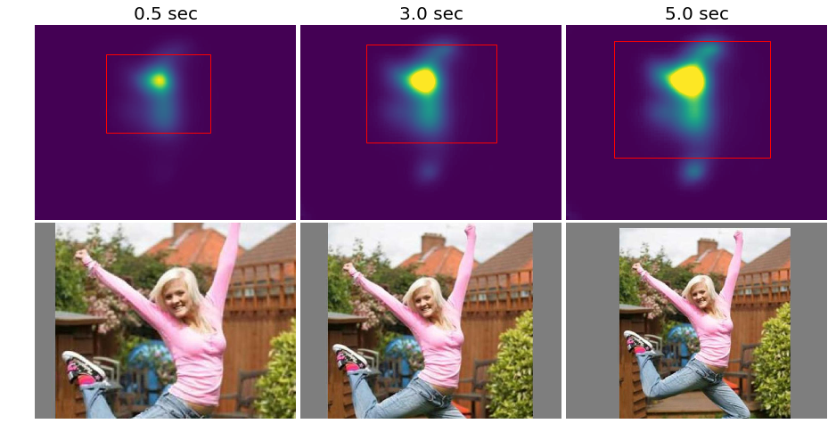
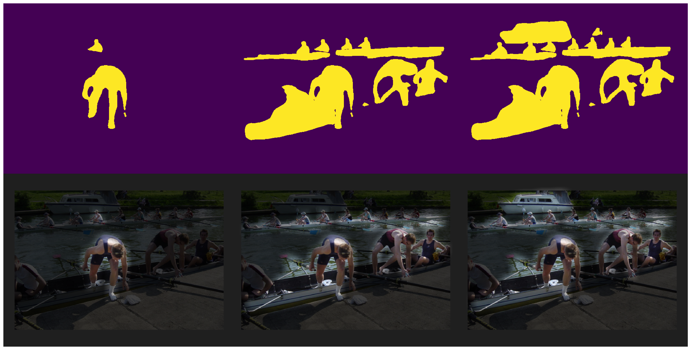
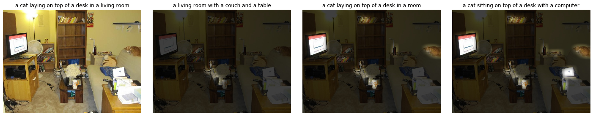

# Multi-Duration Applications 

This folder contains code for the cropping, rendering, and captioning applications discussed in our paper. 

## Cropping

For each viewing duration, we use the [`yiling-chen/flickr-cropping-dataset` repo](https://github.com/yiling-chen/flickr-cropping-dataset) (based on [this paper](https://yiling-chen.github.io/flickr-cropping-dataset/)) to identify a crop that contains 90% of the cumulative saliency. Code in `cropping.ipynb`.

## Rendering

We use a Mask R-CNN trained on MS COCO (code from [matterport/Mask-RCNN](https://github.com/matterport/Mask_RCNN/tree/3deaec5d902d16e1daf56b62d5971d428dc920bc); [paper by He et al.](https://arxiv.org/abs/1703.06870)) to detect objects in the images. For each viewing duration, we identify the intances with average cumulative saliency in the 90th% percentile, and then blur and darken the rest of the image for visualization purposes.

## Captioning

We use the captioning model from [mzhangyb/self-critical.pytorch](https://github.com/mzhangyb/self-critical.pytorch), based on the paper ["Discriminability objective for training descriptive captions"](http://openaccess.thecvf.com/content_cvpr_2018/papers/Luo_Discriminability_Objective_for_CVPR_2018_paper.pdf) by Luo et al. We create multi-duration captions by generating captions for the visualizations from our multi-duration rendering pipline.

